<div align="center">

# 📦 DemandLens

### AI-Powered Enterprise Inventory Demand Prediction System

**Predict demand. Prevent stockouts. Optimize reorders — in real time.**

[](https://www.djangoproject.com/)
[](https://react.dev/)
[](https://www.postgresql.org/)
[](https://tailwindcss.com/)
[](https://pm2.keymetrics.io/)
[](https://azure.microsoft.com/)
[](LICENSE)

---

[Overview](#-project-overview) · [Gallery](#️-application-gallery-screenshots) · [Features](#-features--capabilities) · [AI Models](#-ai-forecasting-engine) · [Architecture Flow](#-system-architecture--sequence-flow) · [Setup Guide](#-getting-started)

</div>

---

## 📋 Table of Contents

1. [Project Overview](#-project-overview)
2. [Application Gallery](#️-application-gallery-screenshots)
3. [Features & Capabilities](#-features--capabilities)
4. [AI Forecasting Engine](#-ai-forecasting-engine)
5. [System Architecture & Sequence Flow](#-system-architecture--sequence-flow)
6. [Project Folder Structure (For Beginners)](#-project-folder-structure-for-beginners)
7. [Getting Started](#-getting-started)
8. [API Reference](#-api-reference)

---

## 🎯 Project Overview

**DemandLens** is a full-stack, enterprise-grade inventory management and demand forecasting platform. By marrying a robust **Django REST API** backend with a dynamic, glassmorphic **React + Tailwind CSS** frontend, DemandLens provides supply chain executives with unparalleled real-time visibility into stock health, AI-driven predictive forecasting, and automated reorder execution.

### The Problem It Solves

| Enterprise Pain Point | The DemandLens Solution |
|---|---|
| Manual stockout tracking | Automated critical-stock thresholds and immediate alert generation. |
| Guesswork in supply chain | **Multi-model AI forecasting** (LSTM, Random Forest, ETS) looking 7 days ahead. |
| Clunky Excel updates | **Smart Data Management Module** with unified drag-and-drop CSV importing. |
| Dead capital / Overstock | Pareto (ABC) Analysis, Real-time Inventory Turnover Rates, and Risk Scatter Plots. |
| Slow Onboarding | High-conversion SaaS Registration and instant Demo Login access. |

---

## 🖼️ Application Gallery

<details>
<summary><b>📸 Click to view Project Screenshots</b></summary>

<br>

| AI Executive Dashboard | Multi-Model Probability & Charting |
| :---: | :---: |
|  <br> |  <br>  |

| Stock Health | Reorder Alert |
| :---: | :---: |
|  <br> *(Replace with: `docs/assets/data-management.png`)* |  <br>  |


</details>

---

## ✨ Features & Capabilities

### 📊 Executive Dashboard
- **Macro Demand Trend:** Live area chart mapping historical consumption against a 7-day predicted LSTM overlay.
- **Risk Matrix:** A 4-quadrant interactive scatter plot tracking *Current Stock* versus *Predicted Demand*, allowing instant identification of "Urgent Reorder" and "Dead Capital" zones.
- **Inventory Turnover & ABC Analysis:** Live tracking of asset liquidity, Pareto ranking (Top 10 Capital Tied Up), and department consumption breakdowns via dynamic Recharts.
- **SaaS Aesthetics & Micro-interactions:** High-end page transitions (framer-motion) and real-time dashboard state management.

### 🗄️ Smart Data Management
- **Bulk CSV Ingestion:** Premium drag-and-drop zone for rapid Excel/CSV inventory mapping.
- **Intelligent "Smart Add":** Automatically detects existing items and securely *adds* quantity to existing stock without overwriting historical data.
- **Automated Entity Generation:** Instantly handles and structures unknown suppliers and categories on the fly.

### 🚨 Reorder Intelligence Base
- Generates exact reorder quantity parameters = *(forecasted demand + buffer) − projected stock*.
- Three hierarchical alert levels: `REORDER NOW`, `WATCH`, `SAFE`.
- Configurable lead-time models and dynamic safety buffers via secure environment variables.

### 👤 Identity & Security
- Fully functioning enterprise authentication base and profile management.
- Rapid Demo Login architecture via `X-Demo-Token` injection for immediate SaaS demonstration.

---

## 🧠 AI Forecasting Engine

DemandLens natively incorporates three distinct forecasting algorithms within Python, evaluating and selecting the most accurate prediction baseline tailored to individual SKU velocity:

1. **LSTM (Long Short-Term Memory) Neural Networks:** Captures deep, non-linear macroscopic trends across the entire supply chain footprint.
2. **Exponential Smoothing (ETS):** Baseline standard (via `statsmodels`) utilized for highly seasonal or predictable items with ≥7 days of history.
3. **Random Forest Ensembles:** Employed to mitigate sudden spikes and manage erratic consumption behavior through decision-tree averaging.

**Enterprise AI Features:**
*   **Anomaly Detection:** Built-in heuristics label highly abnormal historical spikes with visible UI markers to contextualize data distortions.
*   **Accuracy Transparency:** The engine automatically calculates MAPE, RMSE, and R² scores for each model, exposing forecast validity directly to the user.
*   **Actionable Data Export:** One-click module to dump explicit multi-model coordinate data directly to CSV.

---

## 🏗 System Architecture & Sequence Flow

DemandLens utilizes a robust production deployment architecture designed for High Availability. Deployable both via containerized Azure Web Apps or self-hosted PM2 persistent execution.

### Data Flow & Logic Sequence

This sequence outlines the lifecycle of a user uploading data and deriving an AI-driven Reorder Alert.

```mermaid
sequenceDiagram
    autonumber
    actor U as Supply Chain User
    participant CLI as React Frontend
    participant API as Django API Service
    participant DB as PostgreSQL DB
    participant AI as AI Engine (SciKit/TF)
    
    U->>CLI: Drag & Drop CSV Data
    CLI->>API: POST /data/upload-csv/
    API->>DB: Evaluate "Smart Add" & Update Stock
    DB-->>API: Rows Synchronized
    API-->>CLI: Success Response
    
    U->>CLI: Request Demand Recommendation
    CLI->>API: POST /forecast/run/
    API->>DB: Query 2-Year Trailing Consumption
    DB-->>API: Return Array of Demand Data
    API->>AI: Trigger Forecast Engines
    
    rect rgb(34, 43, 54)
    Note over AI: 🧠 Start AI Evaluation
    AI->>AI: Generate Random Forest Ensemble
    AI->>AI: Generate StatsModels ETS
    AI->>AI: Compute LSTM Activation Flow
    AI->>AI: Isolate lowest MAPE (highest accuracy)
    end
    
    AI-->>API: Return Best Model & Outlier/Anomaly Flags
    API->>DB: Record ForecastResult & Alert Level
    API-->>CLI: Render Recharts with Recommendations
    CLI-->>U: Display Visual Forecast & Actions
```



---

## 📁 Project Folder Structure (For Beginners)

If you are new to the codebase, here is the high-level map of where essential logic is housed:

```text
DemandLens/
├── backend/                  # Django Python Server Environment
│   ├── api/                  # Main platform endpoints & User Authentication views
│   ├── config/               # Base Django logic (settings.py, base URLs, WSGI)
│   ├── forecasting/          # 🧠 AI Engine - LSTM, Random Forest & ETS Math Models
│   ├── inventory/            # DB Models: Items, Suppliers, Stock Management
│   ├── alerts/               # Analytics logic calculating reorder points & thresholds
│   ├── manage.py             # Django entry initialization
│   ├── requirements.txt      # Python backend dependencies
│   └── seed_data_enhanced.py # Run this to auto-populate the database with 2 years of demo data!
│
├── frontend/                 # React 19 + Vite + Tailwind 4 Application
│   ├── public/               # Static base assets (Favicon, Template CSVs)
│   ├── src/
│   │   ├── components/       # Reusable UI fragments (Navigation, Loaders, Dialogs)
│   │   ├── pages/            # 🖥️ Core Views (Dashboard.jsx, Forecasting.jsx, Login.jsx)
│   │   ├── App.jsx           # Main React Router & Authentication Context hub
│   │   └── index.css         # Custom Tailwind utilities & Glassmorphic variables
│   ├── package.json          # Node.js frontend dependencies
│   └── vite.config.js        # Vite compilation rules
│   
├── .github/workflows/        # CI/CD pipelines (e.g. deploy.yml for GitHub Actions)
├── ecosystem.config.js       # PM2 setup for automatic Linux background restarts
└── README.md                 # You are exactly here 😉
```

---

## 🚀 Getting Started

### Prerequisites
*   **Python** 3.11+
*   **Node.js** 20.x+
*   **PostgreSQL** 15+

### 1. Database Provisioning
```sql
psql -U postgres
CREATE DATABASE demandlens_db;
CREATE USER demandlens_user WITH PASSWORD 'secure_password';
GRANT ALL PRIVILEGES ON DATABASE demandlens_db TO demandlens_user;
\q
```

### 2. Backend Initialization
```bash
cd backend
python -m venv venv
source venv/bin/activate  # Windows: venv\Scripts\activate

pip install -r requirements.txt

# Configure your environment variables (.env)
python manage.py migrate

# Seed database with 2 years of supply chain test data
python seed_data_enhanced.py

python manage.py createsuperuser
python manage.py runserver
```

*(Create a `.env` in `/backend` containing `DB_NAME`, `DB_USER`, `DB_PASSWORD`, `DJANGO_SECRET_KEY`, `DEFAULT_LEAD_TIME_DAYS`, and `SAFETY_BUFFER`).*

### 3. Frontend Initialization
```bash
cd frontend
npm install --legacy-peer-deps
npm run dev
```
Navigate to **http://localhost:5173**.

---

## 📡 API Reference

Base URL: `http://localhost:8000/api`

### Core Endpoints
| Category | Method | Endpoint | Description |
|---|---|---|---|
| **Auth** | `POST` | `/auth/login/` | Standard user authentication or demo login entry |
| **Data Ingestion** | `POST` | `/data/upload-csv/` | Handles bulk multipart CSV uploads with "Smart Add" stock resolution |
| **Analytics** | `GET` | `/analytics/macro-trend/` | 14-day historical vs 7-day system projection |
| **Analytics** | `GET` | `/analytics/turnover-rate/` | Velocity calculations and COGS turnover equations |
| **Items & AI** | `POST` | `/forecast/run/` | Triggers the complete AI Multi-Model generation sequence |
| **Items & AI** | `GET` | `/items/:id/forecast/` | Isolated robust forecast mapping including anomaly points |

---
<div align="center">
  <sub>DemandLens • Intelligent Supply Chain Software Suite</sub>
</div>
